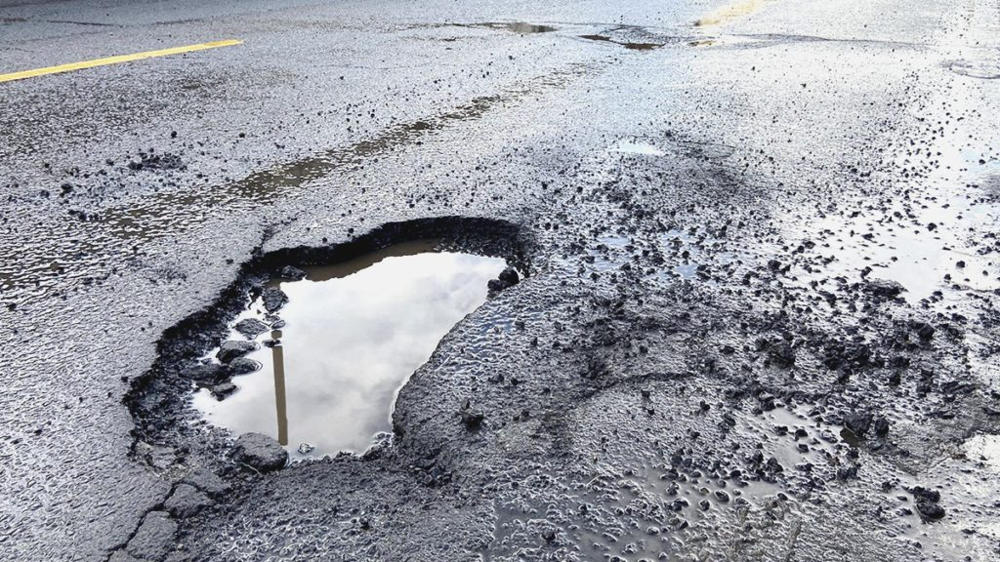
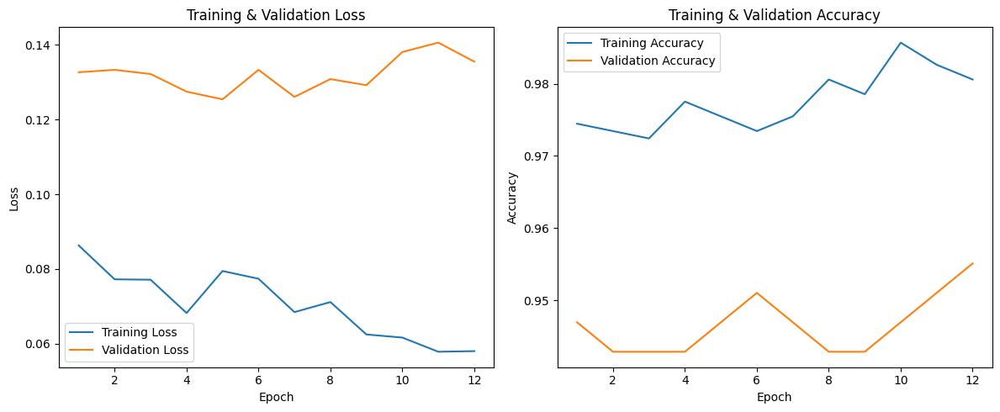
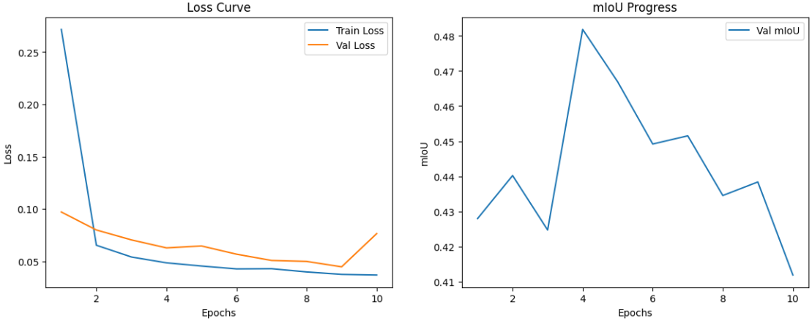

# 🛣️ Road Damage Detection System

**AI-Powered Road Surface Defect Identification using YOLOv8**


## 📘 Overview

The **Road Damage Detection System** is an AI-powered application built to automatically **detect and categorize different types of road surface damage** — such as **potholes** and **cracks** — from images and videos.
It is designed to assist government authorities, urban planners, and maintenance agencies in improving **road safety**, **infrastructure quality**, and **maintenance efficiency** using **computer vision and deep learning**.


## 🚀 Key Features

| Feature                           | Description                                                                                                |
| --------------------------------- | ---------------------------------------------------------------------------------------------------------- |
| 🧠 **YOLOv8-based Detection**     | Built using **Ultralytics YOLOv8-Small** model, fine-tuned on the **CRDDC 2022 (Japan + India)** dataset.  |
| 🖼️ **Multi-Mode Input**          | Detect road damages from **images**, **videos**, and **realtime webcam streams** (optional).               |
| 📊 **Performance Dashboard**      | Integrated visualization of **Precision-Recall curves**, **Confusion Matrix**, and **Example Detections**. |
| ⚙️ **Streamlit Interface**        | Lightweight and interactive front-end for easy upload, visualization, and testing.                         |
| 🧩 **Multi-Class Classification** | Detects 4 major types of road damages.                                                                     |
| 💾 **Local + Cloud Ready**        | Runs seamlessly on your local environment or Streamlit Cloud.                                              |


## 🧩 Types of Road Damages Detected

| Damage Type               | Description                                                                            | Example                                                         |
| ------------------------- | -------------------------------------------------------------------------------------- | --------------------------------------------------------------- |
| **🕸️ Alligator Crack**   | Networked cracks resembling scales, caused by fatigue or structural failure.           |     |
| **↕️ Longitudinal Crack** | Cracks running parallel to the road’s centerline, often from pavement shrinkage.       |  |
| **↔️ Transverse Crack**   | Cracks running perpendicular to traffic, typically caused by temperature fluctuations. |   |
| **🕳️ Pothole**           | Depressions formed due to water infiltration and traffic stress.                       |                        |


## 🧠 Model Architecture

The system leverages **YOLOv8-Small** from the **Ultralytics** framework — a modern object detection architecture combining **CSPDarknet**, **SPPF**, and **PAN-FPN** blocks.

**Architecture Highlights:**

* Input size: `640×640`
* Optimizer: `SGD`
* Loss: `Box + Objectness + Classification`
* Transfer Learning: Pre-trained on COCO
* Custom fine-tuning: Japan + India RDD2022 subsets


## 🗂️ Dataset Description

**Dataset:** [Crowdsensing-based Road Damage Detection Challenge 2022 (CRDDC2022)](https://github.com/sekilab/RoadDamageDetector)

| Country                     | No. of Images | Source             | Used in               |
| --------------------------- | ------------- | ------------------ | --------------------- |
| Japan                       | ~9,000        | Dashcam            | Training + Validation |
| India                       | ~7,000        | Street-level       | Training + Validation |
| Others (China, Norway, USA) | Optional      | Cross-testing only | -                     |

**Label Format Conversion:**
The dataset was converted from **Pascal VOC → YOLOv8 format** using `0_PrepareDatasetYOLOv8.ipynb`, including:

* Train/Validation split (80:20)
* Background removal
* Category remapping

**YOLOv8 Dataset Config File:**

```yaml
train: dataset/rddJapanIndiaFiltered/India/images/train
val: dataset/rddJapanIndiaFiltered/India/images/val

nc: 4
names: ['Longitudinal Crack', 'Transverse Crack', 'Alligator Crack', 'Potholes']
```


## ⚙️ Training Configuration

| Parameter     | Value                      |
| ------------- | -------------------------- |
| Model         | YOLOv8-Small               |
| Epochs        | 100                        |
| Batch Size    | 16                         |
| Image Size    | 640×640                    |
| Optimizer     | SGD                        |
| Learning Rate | 0.01                       |
| GPU           | NVIDIA RTX 2060            |
| Dataset       | CRDDC 2022 (Japan + India) |

**Training Notebook:**
📄 `training/1_TrainingYOLOv8.ipynb`
Handles model initialization, augmentation, and checkpoint saving.

**Preprocessing Notebook:**
📄 `training/0_PrepareDatasetYOLOv8.ipynb`
Cleans and reformats the RDD dataset.

## 📊 Training Performance Visualization

<table align="center">
  <tr>
    <td align="center">
      <br>
      <b>Figure 1.</b> Training and Validation Loss & Accuracy Curves
    </td>
    <td align="center">
      <br>
      <b>Figure 2.</b> YOLOv8 Loss Curve and Validation mIoU Progression
    </td>
  </tr>
</table>

**Description:**  
- **Left:** Training and validation loss and accuracy curves demonstrating model convergence.  
- **Right:** YOLOv8 loss curve and validation *mIoU* progression across epochs, reflecting improved generalization during training.


## 📈 Evaluation Results

**Evaluation Notebook:**
📄 `training/2_EvaluationTesting.ipynb`

| Metric       |   Score  |
| ------------ | :------: |
| Precision    | **0.84** |
| Recall       | **0.79** |
| F1-score     | **0.81** |
| mAP@0.5      | **0.82** |
| mAP@0.5:0.95 | **0.67** |

### 📊 Visual Results

| Visualization                                           | Description                                |
| ------------------------------------------------------- | ------------------------------------------ |
|       | Shows inter-class performance consistency. |
|               | Model precision vs recall trade-off curve. |
|  | Example predictions on validation data.    |


## 💻 Streamlit Web Application

The Streamlit interface provides a smooth user experience to **upload, visualize, and download detection results**.

**Application Structure:**

```
RoadDamageDetection/
│
├── Home.py                   # Main app entry point
├── pages/
│   ├── 1 Home
│   ├── 2_Image Detection.py
│   
├── models/YOLOv8_Small_RDD.pt
├── dataset/rddJapanIndiaFiltered/
├── training/*.ipynb
├── resource/*.png, *.gif
└── requirements.txt
```

RoadDamageDetection/
├── Home.py
├── pages/
│   ├── 1 Home
│   ├── 2_Image Detection.py
│   
├── dataset/
│   └── rddJapanIndiaFiltered/
│       ├── India/
│       ├── Japan/
│       └── rdd_JapanIndia.yaml
├── models/
│   └── YOLOv8_Small_RDD.pt
├── training/
│   ├── 0_PrepareDatasetYOLOv8.ipynb
│   ├── 1_TrainingYOLOv8.ipynb
│   └── 2_EvaluationTesting.ipynb
├── resource/
│   ├── confusion_matrix.png
│   ├── PR_curve.png
│   ├── val_batch2_labels.jpg
│   └── val_batch2_pred.jpg
└── requirements.txt


## 🧾 Example Outputs

**Detection Using Image**


**Detection Using image**


## 🧩 Installation & Setup

### 1️⃣ Clone the Repository

```bash
git clone https://github.com/tohid3707/RoadDamageDetection
cd RoadDamageDetection
```

### 2️⃣ Create Environment

```bash
conda create -n rdd python=3.8
conda activate rdd
```

### 3️⃣ Install Dependencies

```bash
# CUDA setup (if GPU available)
# https://docs.nvidia.com/cuda/cuda-installation-guide-linux/index.html

# Install PyTorch + CUDA
conda install pytorch==2.0.0 torchvision==0.15.0 torchaudio==2.0.0 pytorch-cuda=11.8 -c pytorch -c nvidia

# Install required packages
pip install -r requirements.txt
```

### 4️⃣ Run the App

```bash
streamlit run Home.py
```

Access it locally at: [http://localhost:8501](http://localhost:8501)


## 🧩 Model Files

The trained YOLOv8 model weights can be downloaded automatically when running the app or directly from:

```
models/YOLOv8_Small_RDD.pt
```


## 🧪 Future Improvements

* 🧮 Integration with **geospatial data (GPS tagging)** for damage localization
* 📦 Deployment as a **mobile app** using TensorFlow Lite / ONNX Runtime
* 🔍 Real-time inference pipeline for **drone or dashcam systems**
* 🗺️ Heatmap visualization of damage severity and frequency
* 🔁 Model retraining on **RDD2024 / IndianRoadCracks datasets**


## 🧠 Tech Stack

| Category          | Tools                         |
| ----------------- | ----------------------------- |
| **Language**      | Python                        |
| **Frameworks**    | Ultralytics YOLOv8, Streamlit |
| **Data Handling** | NumPy, Pandas, OpenCV, Pillow |
| **Visualization** | Matplotlib, Seaborn           |
| **Deployment**    | Streamlit Cloud, Local Conda  |
| **Hardware**      | GPU: NVIDIA RTX 2060          |


**“Better Roads. Safer Journeys.”**
